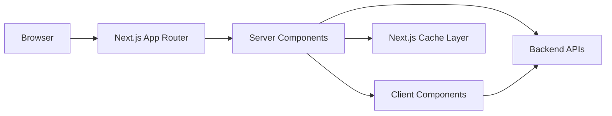
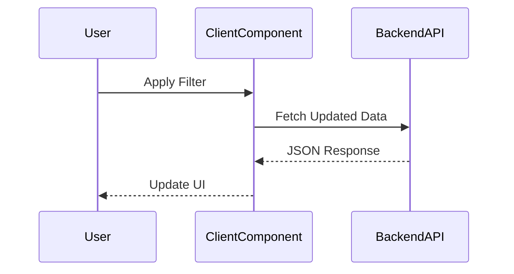

# Frontend Architecture Design

## 1. Overall Approach

This platform is a data-heavy enterprise SaaS system with:

- Real-time dashboards
- Large-scale inventory management (100k–1M records)
- Aggregated reporting
- Deep drill-down views

The architecture follows a **server-first design philosophy** using the Next.js App Router.

Goals:

- Minimize client-side JavaScript
- Push computation to the server
- Maintain strong performance at scale
- Keep UX clean for complex data
- Support enterprise-level security

---



---

# 2. App Router vs Pages Router

I would choose **App Router**.

Not because it’s newer, but because it better fits this system.

### Why App Router?

- Built-in support for React Server Components
- Streaming support
- Nested layouts
- Colocation of data fetching and UI
- Better long-term scalability

For a large enterprise application, reducing client-side JavaScript and keeping logic server-driven is extremely important. App Router enables that cleanly.

Pages Router works, but it shifts more responsibility to the client, which is not ideal for a data-heavy system.

---

# 3. Server Components vs Client Components

### Core Principle

Everything is a **Server Component by default**.  
Client Components are used only where necessary.

---

## Server Components (Majority of the Application)

Used for:

- Dashboard data rendering
- Reports
- Detail pages
- Initial inventory page load

Why?

- No JavaScript sent to browser
- Better performance
- Secure (tokens stay on server)
- Smaller client bundle
- Direct backend access

This significantly improves performance in enterprise dashboards.

---

## Client Components (Used Carefully)

Used only for:

- Filters
- Search inputs
- Sorting
- Pagination
- Interactive charts
- Forms

Instead of making entire pages client-rendered, only small interactive sections are client components. This reduces hydration cost and improves performance.

---

# 4. SSR vs SSG vs ISR Strategy

Different parts of the platform require different rendering strategies.

---

## Dashboard

Server-side rendered.

Dashboards are user-specific and should reflect fresh data. Some summary metrics may use short revalidation (30–60 seconds) if acceptable.

---

## Inventory Management (100k–1M Records)

Initial page load: Server-rendered with first page of results.

All filtering, sorting, and pagination:

- Server-side pagination
- Client-side requests for interaction

The full dataset is never loaded in the browser.

---

## Reporting

Reports usually involve heavy calculations (like totals, trends, or grouped data over time).
Running these calculations every time a user opens the page can put unnecessary load on the backend.

If the business allows the data to be slightly delayed (for example, up to 1 minute old), I would cache the report results for a short time and automatically refresh them in the background.

This way:

- Users still see fast-loading reports

- The backend is not repeatedly running expensive queries

- The system scales better as usage grows

---

## Static Pages

Any marketing or help pages would use static generation and CDN caching.

---

# 5. Data Fetching Strategy



The approach is simple:

- Fetch on the server whenever possible.
- Fetch on the client only when interaction requires it.

---

## Server-Side Fetching

Used for:

- Dashboards
- Reports
- Detail pages
- Initial inventory load

Benefits:

- Secure token handling
- Reduced client complexity
- Built-in Next.js caching
- Cleaner architecture

---

## Client-Side Fetching

Used for interactive updates:

- Filters
- Search
- Pagination
- Sorting

A data-fetching library like React Query would be used to provide:

- Caching
- Background refetching
- Request deduplication
- Smooth pagination (keep previous data)

This ensures responsive UX without UI flicker.

---

# 6. Caching & Revalidation

For enterprise-scale systems, caching is critical.

Strategy:

- Short revalidation for dashboards
- Server-side pagination for inventory
- ISR or timed revalidation for expensive reports
- No caching for highly sensitive or real-time detail views

This balances freshness with performance and backend efficiency.

---

# 7. Hydration Strategy

Hydration can significantly impact performance in large applications.

To keep performance optimal:

- Keep most components server-rendered
- Avoid sending large JSON payloads to the client
- Hydrate only interactive components
- Keep table rows lightweight and stateless

The goal is to minimize JavaScript execution in the browser.

---

# Folder Structure

```
src/
│
├── app/
│   ├── layout.tsx                # Root layout
│   ├── globals.css
│
│   ├── (auth)/                   # Auth-related routes
│   │   ├── login/
│   │   └── forgot-password/
│
│   ├── dashboard/
│   │   ├── page.tsx              # Server Component
│   │   ├── DashboardStats.tsx
│   │   └── DashboardCharts.client.tsx
│
│   ├── inventory/
│   │   ├── page.tsx              # Server Component
│   │   ├── InventoryTable.client.tsx
│   │   ├── InventoryFilters.client.tsx
│   │   └── components/
│   │
│   ├── reports/
│   │   ├── page.tsx
│   │   └── components/
│   │
│   ├── details/
│   │   └── [id]/
│   │       └── page.tsx
│
├── components/                   # Reusable UI components
│   ├── ui/
│   ├── table/
│   ├── charts/
│   └── layout/
│
├── hooks/                        # Custom React hooks
│   ├── useDebounce.ts
│   ├── useTableState.ts
│   └── usePagination.ts
│
├── lib/                          # Shared utilities
│   ├── api.ts
│   ├── fetcher.ts
│   ├── constants.ts
│   └── validators.ts
│
├── store/                        # Lightweight state management (Zustand)
│   ├── tableStore.ts
│   └── uiStore.ts
│
├── types/                        # Global TypeScript types
│   ├── inventory.ts
│   ├── report.ts
│   └── api.ts
│
└── styles/
    └── tokens.css
```
