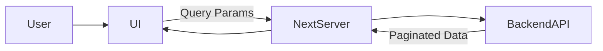
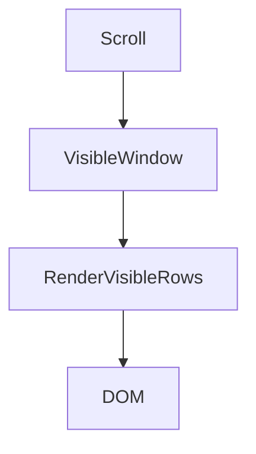
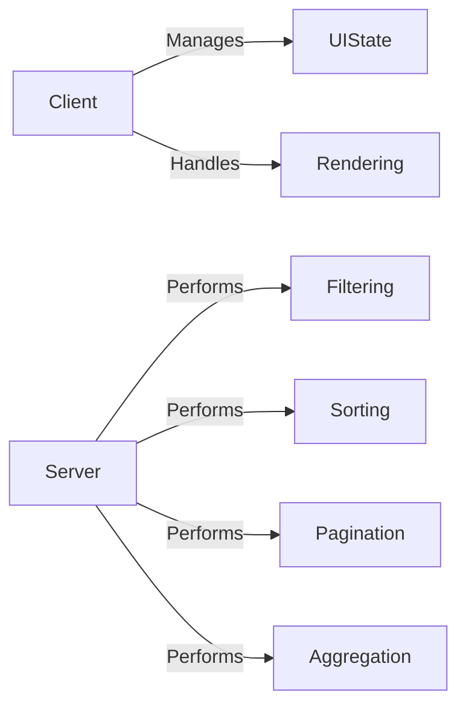

# Large-Scale Data Strategy

# 1. Overview

The Inventory module must support datasets ranging from 100,000 to over 1 million records.

The frontend should never attempt to:

- Load the full dataset into memory
- Perform filtering or sorting on large datasets in the browser
- Render thousands of DOM nodes at once

Guiding principle:

> The server owns the data.  
> The client owns the interaction.

The backend handles heavy data operations.  
The frontend focuses on UX, state management, and efficient rendering.

---

# 2. High-Level Data Flow



Flow:

1. User applies filter/sort/pagination.
2. UI updates query parameters.
3. Server requests filtered data from backend.
4. Backend returns only requested slice.
5. UI renders only visible rows (virtualized).

---

# 3. Tables with 100k+ Rows

## Core Rules

- Always use server-side pagination
- Fetch only required page (25–100 rows)
- Never load full dataset
- Use row virtualization
- Keep row components lightweight

---

# 4. Filtering, Sorting, Pagination

All heavy operations are handled on the backend.

Reasons:

- Databases are optimized for filtering and sorting
- Prevents browser memory issues
- Ensures scalability
- Keeps frontend fast and simple
- We prefer pagination over infinite scroll because it is simpler and more predictable. Infinite scroll requires continuous tracking of scroll position and managing data before and after the viewport, which adds unnecessary complexity and performance overhead for large datasets.

---

## Request Example

```
GET /inventory
?page=2
&pageSize=50
&sort=name:asc
&status=active
&search=router
```

## Expected Response

```json
{
  "data": [],
  "totalCount": 125430,
  "page": 2,
  "pageSize": 50
}
```

Required API capabilities:

- Server-side pagination
- Sorting support
- Filtering support
- Search support
- Total record count
- Stable response shape

Cursor-based pagination is preferred for very large datasets.

---

# 5. Virtualization Strategy

Even 100 rows × many columns can become expensive to render.

Virtualization ensures:

- Only visible rows are rendered
- Off-screen rows are not mounted
- DOM remains small
- Scrolling stays smooth

---

## Virtualization Diagram



---

## Virtualized Table (Pseudo Code)

```tsx
"use client";

import { useVirtualizer } from "@tanstack/react-virtual";

function InventoryTable({ rows }) {
  const parentRef = useRef(null);

  const rowVirtualizer = useVirtualizer({
    count: rows.length,
    getScrollElement: () => parentRef.current,
    estimateSize: () => 40,
  });

  return (
    <div ref={parentRef} style={{ height: 600, overflow: "auto" }}>
      <div
        style={{
          height: rowVirtualizer.getTotalSize(),
          position: "relative",
        }}
      >
        {rowVirtualizer.getVirtualItems().map((virtualRow) => {
          const row = rows[virtualRow.index];

          return (
            <div
              key={row.id}
              style={{
                position: "absolute",
                transform: `translateY(${virtualRow.start}px)`,
              }}
            >
              <Row row={row} />
            </div>
          );
        })}
      </div>
    </div>
  );
}
```

---

# 6. State Management Strategy

State is divided into:

## 1. Server State (Data)

Managed using React Query.

Responsibilities:

- Caching
- Deduplication
- Background refetch
- Keep previous page during pagination

---

## Data Fetching (Pseudo Code)

```tsx
const { data, isLoading } = useQuery({
  queryKey: ["inventory", filters, page, sort],
  queryFn: () => fetchInventory({ filters, page, sort }),
  keepPreviousData: true,
  staleTime: 30000,
});
```

This ensures smooth pagination without UI flicker.

---

## 2. UI State

Managed via:

- Local state or
- Lightweight store (e.g., Zustand)

Examples:

- Selected rows
- Column visibility
- Filter inputs
- Table preferences

---

## URL Sync Strategy

Filters and sorting sync with URL:

```tsx
router.push({
  query: {
    page,
    sort,
    status,
    search,
  },
});
```

Benefits:

- Deep linking
- Shareable views
- Browser back/forward support

---

# 7. Client vs Server Responsibilities



## Server Owns

- Filtering
- Sorting
- Pagination
- Aggregation
- Total record count

## Client Owns

- Interaction
- Loading states
- Debouncing
- Rendering optimization
- URL synchronization

---

# 8. Performance Optimizations

To support enterprise scale:

- Server-side pagination only
- Row virtualization
- Debounced search (300–500ms)
- Memoized row components
- Stable keys for rows
- Avoid large JSON payloads
- Reasonable page sizes
- Avoid unnecessary re-renders
- Web Workers for rare heavy client computations
